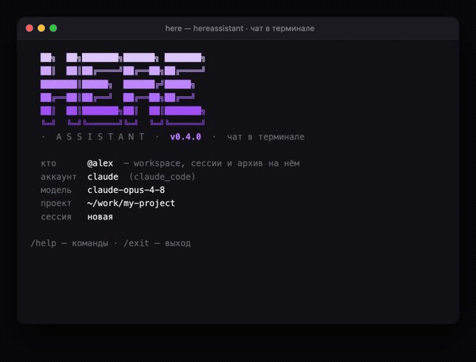
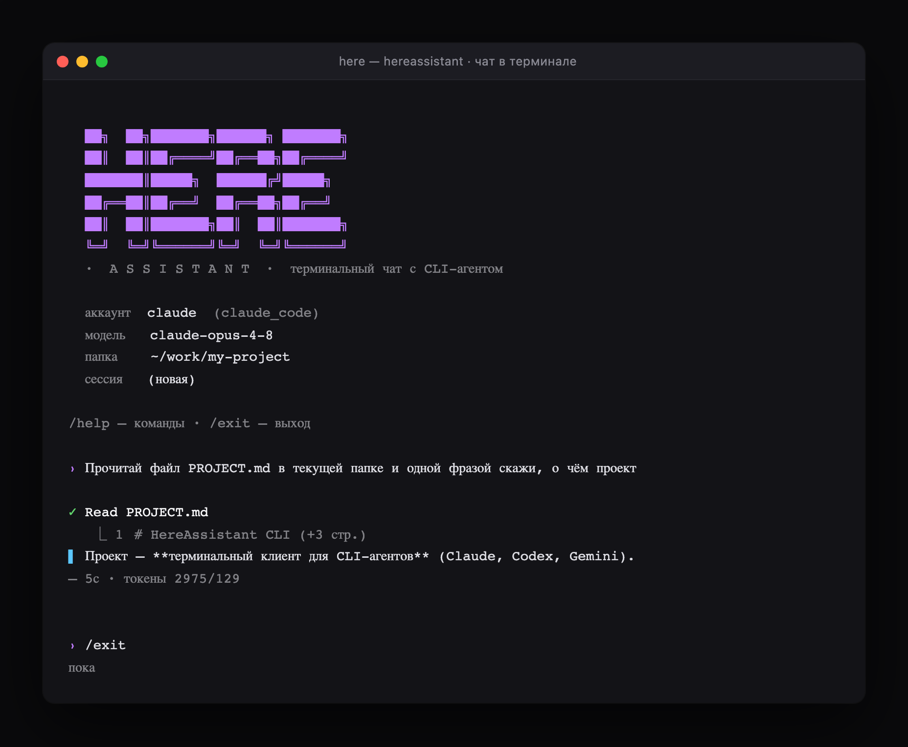
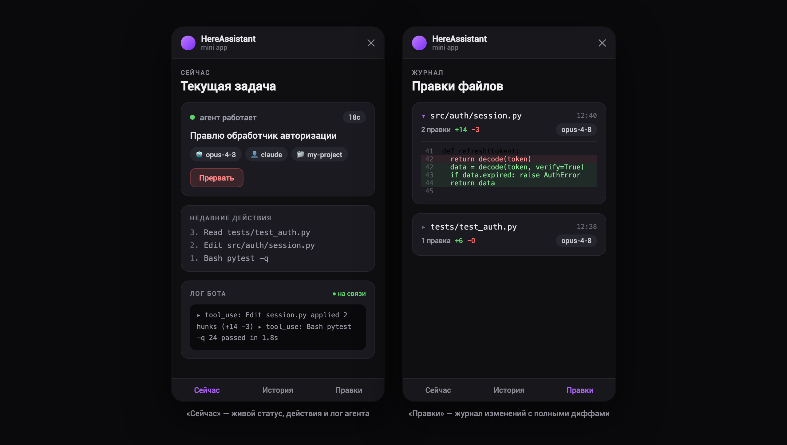
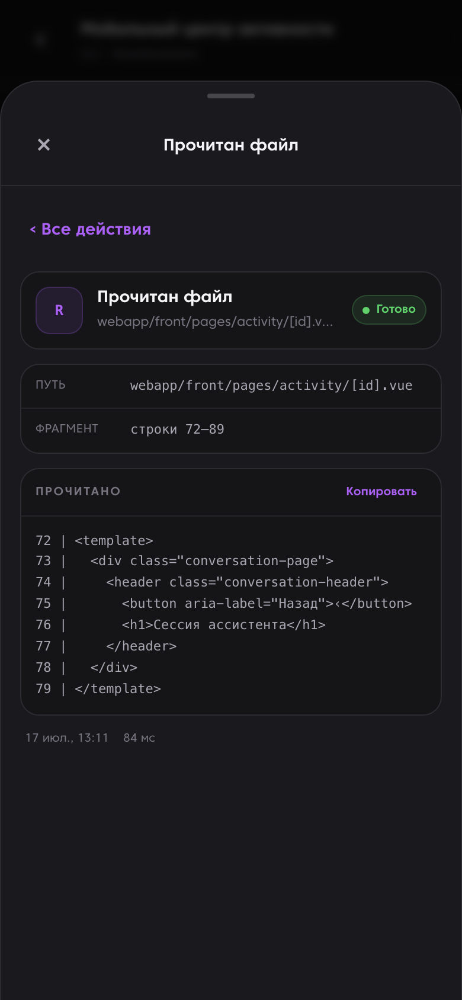
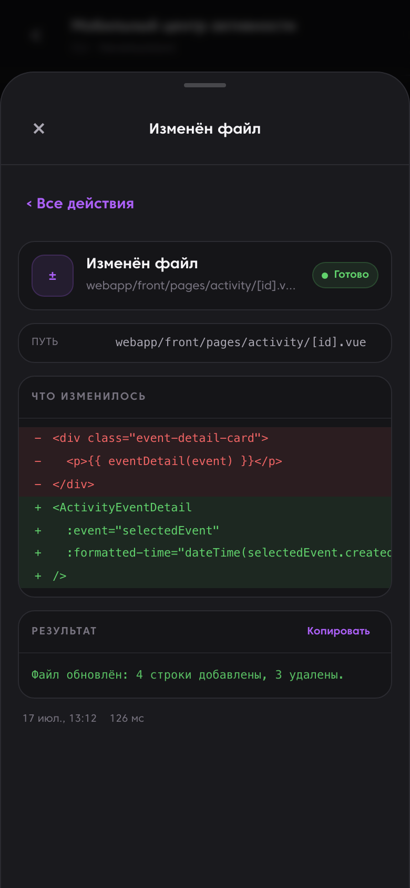
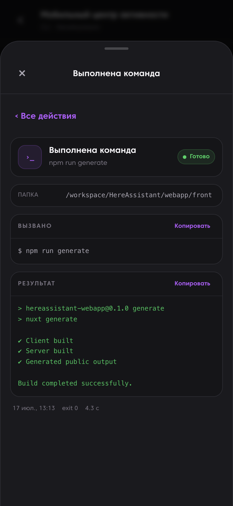
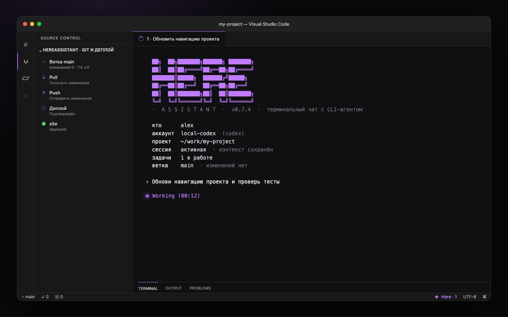
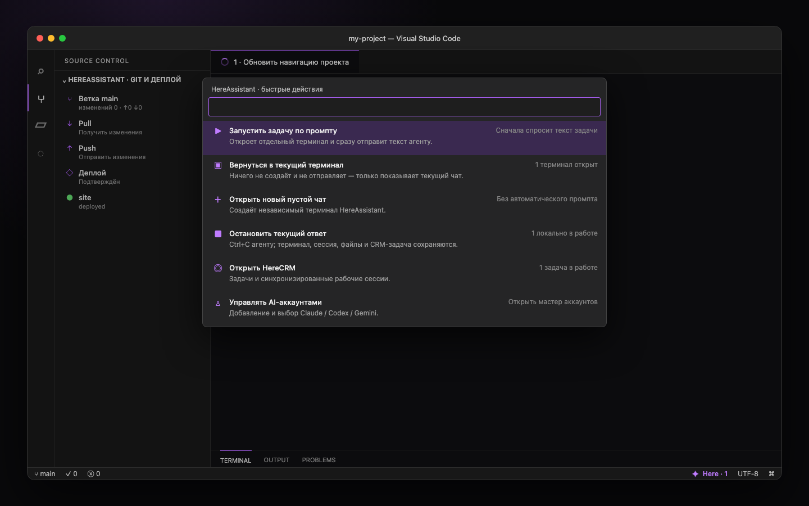

# HereAssistant

🌐 **[hereassistant.hereagency.ru](https://hereassistant.hereagency.ru)** · 🇷🇺 [Русская версия](README.ru.md)

A personal Telegram bot that bridges you to CLI coding agents — **Claude Code, Codex CLI, Gemini CLI and Qwen Code** — running on your own machine. Write code, run tasks and manage projects from any device through Telegram, powered by your existing AI subscriptions or coding plans.



<sub>The terminal client (`python chat.py`) — reasoning, tool calls and the answer stream live, like the native `claude`. The same thing runs in Telegram.</sub>

**Privacy-first by design:** every project is `private` by default — message contents, diffs and tool logs are **not stored**, and nothing is ever sent to external systems (CRM). This can only be relaxed per project via an explicit `.hereassistant/project.yml` file — see [docs/privacy.md](docs/privacy.md).

## Features

- **Multiple providers, one chat** — Claude Code, Codex, Gemini and Qwen Code as isolated CLI subprocesses; switch accounts and models with inline buttons.
- **Terminal chat (`python chat.py`)** — an interactive REPL right in your console, like the native `claude`: a prompt, full live output, slash-command suggestions, `/resume`, safe Codex sandbox modes through `/permissions`, and a live terminal title with the task name/count, working animation and an explicit `✕` while work remains unfinished. Runs on the same subscription accounts as the bot.
- **Team access, managed from the bot** — newcomers file an access request; the owner approves with one tap (`✅ / 👑 admin / ⛔`). Access modes via `/access` (open / approve / admins-only), roles and member search via `/users` — everything lives in the DB, no `.env` editing or restarts to add teammates.
- **Account isolation** — each subscription has an explicit owner or shared flag and lives in its own auth home (`CLAUDE_CONFIG_DIR` / `CODEX_HOME` / `HOME` / `QWEN_HOME`); users never fall back to another owner's profile.
- **User-scoped repositories** — clone only from allowlisted Git hosts, switch registered projects, create isolated branch worktrees, inspect/pull, and confirm pushes from Telegram.
- **Live progress** — streaming progress message in chat while the agent works; interrupt by sending a new message.
- **Rich Messages (Bot API 10.1)** — final answers via `sendRichMessage` with native tables, headings, code blocks and math; answer text streams as an animated `sendRichMessageDraft` preview. Automatic fallback to the classic HTML path.
- **Native session resume** — Claude sessions continue via `--resume`; context survives without storing your data.
- **Web Mini App** — history, live status, file-change journal and one view of local/server contours, Git divergence, disk and confirmed deployment state (Nuxt 3), authenticated via Telegram initData.
- **VS Code Workbench** — task-named terminal-editor tabs, an animated status-bar quick menu, multiline input, local/server heartbeats, CRM state, and Git/deploy status inside Source Control.
- **File exchange** — send documents/photos/voice to the agent; long answers come back as Markdown files.
- **Voice input** — transcription via faster-whisper.
- **Stats and events** — token usage, durations and errors per model/account (metrics only, never content).
- **RTK savings** — per-owner aggregate context-token savings via `/rtk` and the Web Mini App; command arguments and project paths are scrubbed after each provider run.
- **Self-restart** — `/deploy` applies code changes and reports back with a diff.
- **Optional service API** — `/api/v1/tasks*` for external systems, guarded by a bearer token that can never see private/local projects.

## Quick start (Ubuntu, production)

```bash
git clone https://github.com/Creative-Agency-Here/HereAssistant.git && cd HereAssistant
bash scripts/bootstrap_ubuntu.sh     # venv + deps + frontend build + .env template
# fill .env (bot token, admin ids), log in CLI providers (docs/providers.md), then:
pm2 start ecosystem.config.js --only here-assistant-bot,here-assistant-api
```

Full runbook (nginx, HTTPS, autostart): [docs/ubuntu-pm2-nginx.md](docs/ubuntu-pm2-nginx.md).
Sanity check: `bash scripts/check_runtime.sh`. Windows launch is supported as legacy.

Developer/release gate: `scripts/quality_gate.sh` (Python 3.12 contract,
pytest, Ruff, Pyright, compileall, lock, exception and repository hygiene checks).

## Privacy modes

| Mode | Stored locally | Visible to CRM/service API |
|---|---|---|
| `private` (default, no config file) | nothing (metrics only) | never |
| `local` | per explicit `storage.*` flags | never |
| `crm` (explicit opt-in) | per flags | only explicitly allowed data types |

The service token authenticates an external system but **does not bypass** project policy. Details and YAML examples: [docs/privacy.md](docs/privacy.md).

## Architecture

```
Telegram ──▶ bot.py (aiogram) ──▶ providers/* (CLI: claude/codex/gemini/qwen)
                 │                        │ per-account auth homes (.runtime/cli_homes)
                 ▼                        ▼
           bridge.sqlite3 ◀── privacy gates (core/project_config.py)
                 ▲
webapp/front (Nuxt static, nginx) ──▶ webapp/api (aiohttp, 127.0.0.1:8200)
```

- `core/` — config, SQLite schema, events, privacy policy
- `providers/` — CLI wrappers with stream-json parsing
- `handlers/` — Telegram commands and message flow
- `webapp/` — aiohttp API + Nuxt 3 Mini App

## Telegram commands

`/help` · `/accounts` · `/model` · `/cwd` `/project` · `/new` `/reset` · `/status` `/version` · `/stats` `/log` · `/deploy` · `/web`

## Terminal chat

A console REPL over the same subscription accounts as the bot — like the native `claude`, but for
Claude / Codex / Gemini / Qwen behind one prompt.



**Launch**

```bash
python chat.py              # pick an account interactively
python chat.py -a <label>   # jump straight onto an account
```

Or run `python manage.py` and choose **[4] Terminal chat** from the menu.

**Inside** — slash-commands for everything:

`/help` · `/model` · `/account` · `/cwd` · `/new` · `/resume` (pick & continue a past session) ·
`/status` · `/tasks` · `/diff` · `/clear` · `/exit`

**Full transparency** — you see the model's reasoning, every tool call `⏺` and its result `⎿`, the
answer streamed live, with no 4096-char Telegram limit. `/resume` reads the native session store, so
a conversation you started here (or in the CLI directly) can be picked up later.

## Web Mini App

A mobile-first Nuxt 3 Mini App inside Telegram (or in the browser), authenticated via Telegram
`initData`. The activity center combines personal HereCRM sessions, weekly/30-day reports and safe
connection status for Telegram, terminal CLI and CRM. CRM data is visible only to the assistant owner.



- **Now** — live task status, the current step, recent actions and a streaming bot log.
- **Activity** — personal CRM/CLI/Telegram sessions, progressive tool-event details and weekly reports.
- **Edits** — a per-file journal of every change the agent made, with full unified diffs.
- **Connections** — local/server contour states plus safe provider, repository, disk, Git and deployment metadata; credentials, remotes, file names and auth-home paths are never returned.

### Verified action details

Read, Edit, Write, Bash and Agent calls now expand into structured mobile cards: file contents, visual diffs, exact commands, bounded output, status, duration and token counts where available. The pull-up bottom sheet and all five modes are locked by automated tests and real 390 × 844 screenshots.

<table>
  <tr>
    <td></td>
    <td></td>
    <td></td>
  </tr>
</table>

Full verified gallery and reproducible checks: [docs/mobile-activity-proof.md](docs/mobile-activity-proof.md).

## VS Code Workbench

<table>
  <tr>
    <td></td>
    <td></td>
  </tr>
</table>

Install HereAssistant and the dependency-free extension on macOS:

```bash
git clone https://github.com/Creative-Agency-Here/HereAssistant.git
cd HereAssistant
python3 -m venv .venv
.venv/bin/pip install -r requirements.txt
python3 scripts/package_vscode_extension.py
code --install-extension dist/hereassistant-vscode-0.7.5.vsix --force
```

Reload VS Code, click the purple **Here** item in the status bar, choose
**Set up connection**, and select this cloned folder. The menu starts or returns
to terminal sessions, opens HereCRM, and manages AI accounts. To interrupt a
specific response, focus its terminal and use the terminal's regular `Ctrl+C`.
Typing `/` opens the command catalogue; keep typing to filter it, then use Tab,
Enter, or the mouse. `/permissions` offers account, read-only, and workspace
sandbox profiles for Codex. Since the current provider transport is non-interactive
`codex exec`, denied operations fail closed instead of showing a per-command approval dialog.

The extension keeps access keys in VS Code SecretStorage, launches the existing
`chat.py` inside the active workspace, reports real local state through an atomic
runtime file and adds Pull/Push/deploy visibility to Source Control.

Full setup and behavior: [docs/vscode-workbench.md](docs/vscode-workbench.md).

## Docs

- [Onboarding & authorization path](docs/onboarding.md) — BotFather token → claim code → owner, adding teammates, `/logout` (with a flow diagram)
- [Ubuntu production runbook](docs/ubuntu-pm2-nginx.md)
- [Providers & auth homes](docs/providers.md)
- [Privacy modes](docs/privacy.md)
- [Verified mobile activity and screenshot proof](docs/mobile-activity-proof.md)
- [VS Code Workbench](docs/vscode-workbench.md)
- [Security model](SECURITY.md) — this is a remote-code-execution gateway by design; read before deploying
- [Contributing](CONTRIBUTING.md)

## License

[MIT](LICENSE)
