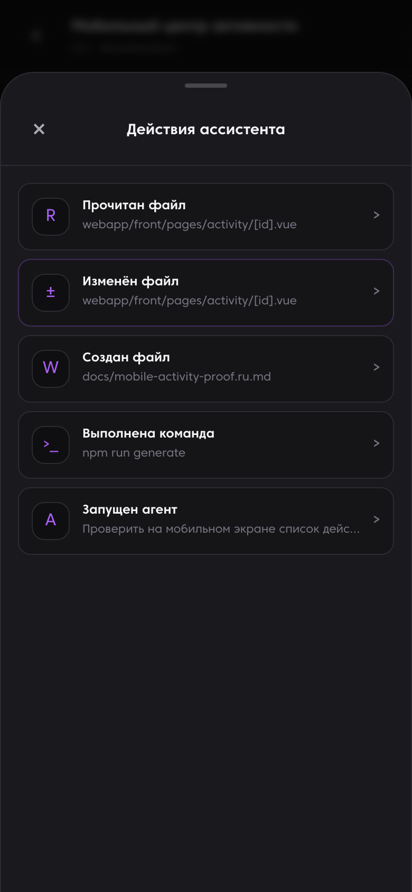
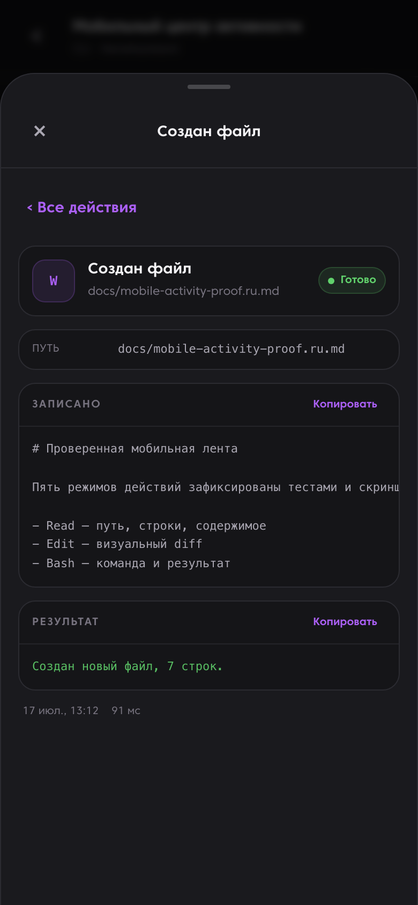
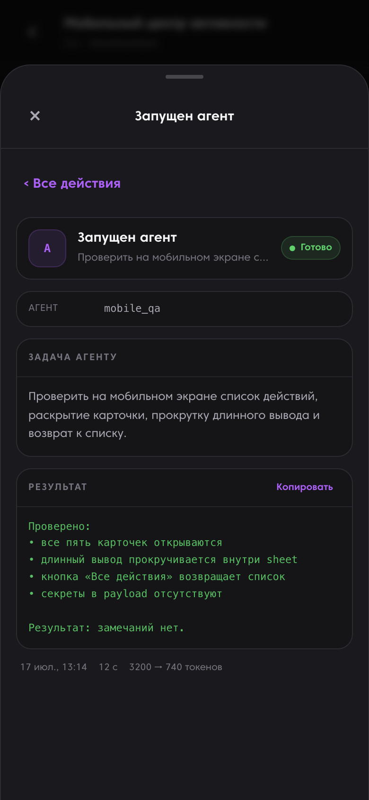

# Проверенная мобильная лента ассистента

Экран «Активность» показывает, что именно вызвал ассистент и что произошло после вызова, не превращая основной диалог в стену логов. Последовательные действия собраны в один bottom sheet; нажатие раскрывает структурированные подробности. Sheet также можно потянуть вверх, свернуть или закрыть жестом вниз.

Скриншоты сняты при мобильном viewport 390 × 844 из собранного Nuxt-приложения. Перед кадром списка браузер выполняет настоящий жест вверх и проверяет, что sheet раскрылся. Автотесты рендера используют тот же fixture. Данные синтетические и не содержат секретов.

## Список действий



## Read и Edit

<table>
  <tr>
    <th>Read: путь, диапазон строк и прочитанное содержимое</th>
    <th>Edit: путь, визуальный diff и результат</th>
  </tr>
  <tr>
    <td></td>
    <td></td>
  </tr>
</table>

## Write и Bash

<table>
  <tr>
    <th>Write: путь, записанное содержимое и результат</th>
    <th>Bash: точная команда, cwd, вывод, exit code и длительность</th>
  </tr>
  <tr>
    <td></td>
    <td></td>
  </tr>
</table>

## Agent



## Зафиксированный контракт

| Режим | Что сохраняется и показывается |
|---|---|
| Read | путь, диапазон строк, ограниченное содержимое, статус и длительность |
| Edit | путь, ограниченные before/after, визуальный diff, результат и статус |
| Write | путь, ограниченный предпросмотр содержимого, результат и статус |
| Bash | точная ограниченная команда, cwd, вывод, exit code, статус и длительность |
| Agent | имя агента, задача, результат, статус, длительность и токены, если они доступны |

Синкер использует явный allowlist, ограничения размера и редактирование секретов до отправки данных в HereCRM. Неизвестные поля отбрасываются. Приватные проекты остаются приватными: расширенный payload отправляется только тогда, когда политика проекта явно разрешает CRM-синхронизацию сессий.

Воспроизводимые проверки:

```bash
cd webapp/front
npm run test:activity
npm run generate
cd ../..
python -m pytest tests/tooling/test_mobile_activity_proof.py
```

English version: [mobile-activity-proof.md](mobile-activity-proof.md).
