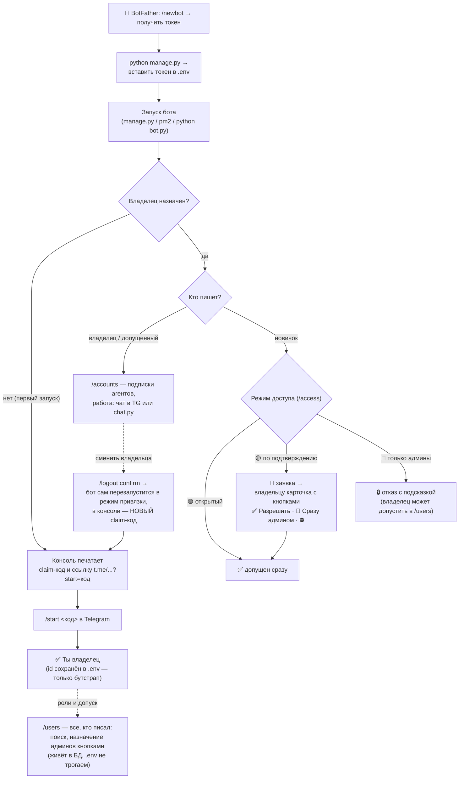

# Авторизация: путь от BotFather до работы

Как бот привязывается к владельцу, как добавить коллег и как сменить владельца.
Весь путь — одна схема:



## Шаг 0 — BotFather (один раз)

1. В Telegram открой [@BotFather](https://t.me/BotFather) → `/newbot`.
2. Придумай имя и username бота → BotFather выдаст **токен** вида `1234567890:AA…`.
3. Токен — это ключ от бота. Никому не показывай и не коммить.

## Шаг 1 — токен в .env

Запусти `python manage.py` — мастер установки сам спросит токен и запишет его
в `.env` (`TELEGRAM_BOT_TOKEN=…`). Либо впиши руками.

## Шаг 2 — первый запуск: claim-окно

Пока владелец не назначен, бот никого не пускает. При старте в консоли
появляется окно привязки:

```
============================================================
  АДМИН НЕ НАЗНАЧЕН
============================================================
  Claim-код: AbC123xYz
  Ссылка:    https://t.me/your_bot?start=AbC123xYz

  Открой ссылку в Telegram и нажми Start.
============================================================
```

Открой ссылку (или отправь боту `/start <код>`) — **первый приславший код
становится владельцем**: его id сохраняется в `.env`, бот отвечает
быстрым стартом (подключить подписку → выбрать папку → писать задачи).

Если отправить `/start` без кода — бот сам объяснит эти шаги.

## Шаг 3 — команда: заявки и роли (всё в боте, .env не трогаем)

Коллега просто **пишет боту** — дальше зависит от режима доступа (`/access`):

- **🟡 По подтверждению** (по умолчанию): коллега получает «📨 Заявка
  отправлена владельцу», а владельцу (и всем админам) приходит карточка:

  ```
  🔔 Заявка на доступ к боту

  ⏳ Паша @pasha · 123456789

  Разрешить работу с агентом?
  [✅ Разрешить] [👑 Сразу админом]
  [⛔ Отклонить]
  ```

  Одно нажатие — и коллега в деле (бот сам напишет ему о решении).
- **🟢 Открытый**: каждый написавший допущен сразу.
- **🔴 Только админы**: работают лишь владельцы и назначенные админы;
  новичку бот подскажет, что доступ открывают в `/users`.

Роли живут в БД: **никакого редактирования .env и рестартов** для добавления
людей больше не нужно. `ADMIN_IDS` в `.env` — только бутстрап владельца.

## /users — все, кто писал боту

`/users` (для админов) — список всех, кто когда-либо писал:
`👑 владелец · ⭐ админ · ✅ допущен · ⏳ заявка · ⛔ отказ`.
Поиск: `/users паша` (по нику, имени или id). Номер → карточка с кнопками:
назначить админом, снять, открыть/закрыть доступ. Сессии и workspace каждого
учитываются отдельно (по его id) — в том числе в терминальном чате.

## Ники подхватываются сами

При каждом сообщении бот дообновляет `@username` и имя в своей БД —
они видны в `/users`, терминальном чате (`chat.py`, строка «кто») и в
атрибуции сессий. Ничего настраивать не нужно.

## Выход и смена владельца — /logout

- Обычный пользователь/админ: `/logout confirm` — закрывает свой доступ
  (вернёт владелец в `/users` одной кнопкой).
- **Последний владелец**: claim-код **ротируется** (старый перестаёт
  работать), бот сам мягко перезапускается в режим привязки — новый код
  в консоли, новый владелец проходит Шаг 2 заново.

В терминальном чате (`chat.py`) выхода два: `/exit` — закрыть чат,
`/user` — переключить, от чьего имени идёт работа.

## Частые вопросы

- **Где взять claim-код, если бот уже крутится в pm2?** `pm2 logs here-assistant-bot`
  — окно привязки печатается при каждом старте, пока владельца нет.
- **Код из консоли не подходит?** Код одноразовый на «поколение» привязки:
  после `/logout confirm` действует только новый, из свежего лога.
- **Потерял доступ к Telegram-аккаунту владельца?** Удали строки
  `ADMIN_TELEGRAM_ID`/`ADMIN_IDS` из `.env`, перезапусти бота — он вернётся
  в режим привязки с новым кодом.
