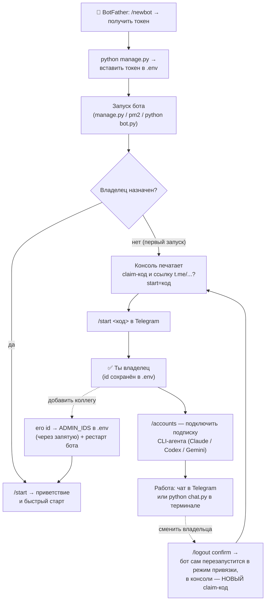

# Авторизация: путь от BotFather до работы

Как бот привязывается к владельцу, как добавить коллег и как сменить владельца.
Весь путь — одна схема:



## Шаг 0 — BotFather (один раз)

1. В Telegram открой [@BotFather](https://t.me/BotFather) → `/newbot`.
2. Придумай имя и username бота → BotFather выдаст **токен** вида `1234567890:AA…`.
3. Токен — это ключ от бота. Никому не показывай и не коммить.

## Шаг 1 — токен в .env

Запусти `python manage.py` — мастер установки сам спросит токен и запишет его
в `.env` (`TELEGRAM_BOT_TOKEN=…`). Либо впиши руками.

## Шаг 2 — первый запуск: claim-окно

Пока владелец не назначен, бот никого не пускает. При старте в консоли
появляется окно привязки:

```
============================================================
  АДМИН НЕ НАЗНАЧЕН
============================================================
  Claim-код: AbC123xYz
  Ссылка:    https://t.me/your_bot?start=AbC123xYz

  Открой ссылку в Telegram и нажми Start.
============================================================
```

Открой ссылку (или отправь боту `/start <код>`) — **первый приславший код
становится владельцем**: его id сохраняется в `.env`, бот отвечает
быстрым стартом (подключить подписку → выбрать папку → писать задачи).

Если отправить `/start` без кода — бот сам объяснит эти шаги.

## Шаг 3 — команда: добавить коллег

Бот отвечает не-авторизованному так:

```
⛔ Доступ пока закрыт — бот уже привязан к владельцу.

Твой id: 123456789
Отправь его владельцу: он добавит тебя в ADMIN_IDS (.env)
и перезапустит бота — после этого /start откроет доступ.
```

То есть: коллега шлёт боту `/start`, копирует свой id из ответа и отдаёт
владельцу. Владелец добавляет id в `.env`:

```
ADMIN_IDS=6691167223,123456789
```

и перезапускает бота. Всё — у коллеги полный доступ, а его сессии и
workspace учитываются отдельно (по его id).

## Ники подхватываются сами

При каждом сообщении бот дообновляет `@username` пользователя в своей БД —
он виден в терминальном чате (`chat.py`, строка «кто») и в атрибуции сессий.
Ничего настраивать не нужно.

## Смена владельца — /logout

- `/logout` → бот покажет, что произойдёт, и попросит подтверждение.
- `/logout confirm` → доступ снят. Если ты **последний владелец**:
  claim-код **ротируется** (старый перестаёт работать), бот сам мягко
  перезапускается в режим привязки — новый код в консоли, новый владелец
  проходит Шаг 2 заново.
- Если владельцев несколько — снимается только твой доступ, бот работает
  дальше.

В терминальном чате (`chat.py`) выхода два: `/exit` — закрыть чат,
`/user` — переключить, от чьего имени идёт работа.

## Частые вопросы

- **Где взять claim-код, если бот уже крутится в pm2?** `pm2 logs here-assistant-bot`
  — окно привязки печатается при каждом старте, пока владельца нет.
- **Код из консоли не подходит?** Код одноразовый на «поколение» привязки:
  после `/logout confirm` действует только новый, из свежего лога.
- **Потерял доступ к Telegram-аккаунту владельца?** Удали строки
  `ADMIN_TELEGRAM_ID`/`ADMIN_IDS` из `.env`, перезапусти бота — он вернётся
  в режим привязки с новым кодом.
